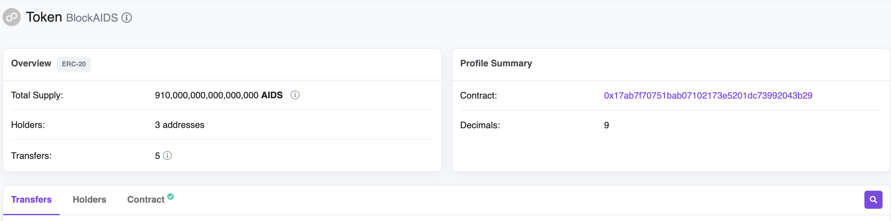
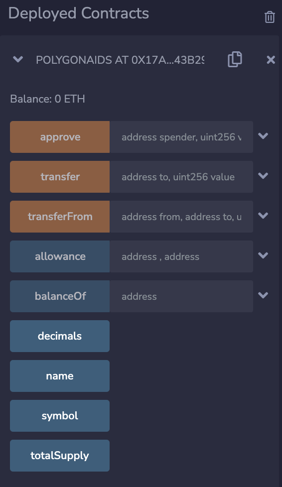

BlockAIDS is a decentralized ecosystem that harnesses the power of blockchain and web3 technologies to serve millions of
people living with HIV/AIDS and key at-risk populations (e.g. intravenous drug users, members of the LGBTQ community,
commercial sex workers). Utilization of this world-class, secure, and private application restores sovereignty to people
affected by this disease by providing access to records, medications, goods, and services from any place in the world.
Additionally, and equally important, the BlockAIDS community serves as a self-governed platform for enhancing the
product itself, education about managing and preventing the disease, and supporting community initiatives.

We are currently building PledgePositive, an adherence tracker and encouragement platform - a subnet designed to promote
and incentivize healthy behaviors, medication adherence practices, and preventive measures. By utilizing a comprehensive
range of rewards and benefits, the system aims to ensure that individuals engage in regular activities that contribute
to their overall health, well-being, and the safety of others.

For more details on achievements thusfar and PledgePositive specifics, please see the
full [BlockAIDS Summary](../README.md).

**An overview of the technology stack to be used**

- Frontend: HTML5, CSS3, MUI, React.js;
- Backend: Node.js, .NET, PostgreSQL;
- Blockchain: Solidity, Hardhat, Remix, Web3.js etc.

## DEMO

## Deploy Smart Contract Using Remix:

- Create a file on Remix, accessing [https://remix.ethereum.org/](https://remix.ethereum.org/)
- Upload pre-built [smart contract](PolygonToken.sol) into the IDE
- Update the smart contract, you can change `name`, `symbol`, `decimals`, `totalSupply`
- Compile the smart contract
- Connect Remix to the Polygon Mumbai via Metamask
- Deploy the smart contract and get the transaction hash
- Verify the smart contract on [Polygon Mumbai Explorer](https://mumbai.polygonscan.com/) by transaction hash

## Usage

### Testing Usage (Remix IDE):

After the smart contract is deployed, in the Remix sidebar('Deployed Contracts' list) you could load the contract from
its address:

### JS Usage:

[Here](https://github.com/blockwebdevs/BlockAIDS-ETH/blob/main/frontend/src/helpers/metamask.ts#L76C14-L76C28) are
examples of how to interact with the smart contract functions using Web3.js.

### Team members

- Andrei Tintari
- Tudor Iovita
- Chris Georgen
- Erin Murphy
- Nicholas Edmonds

### Contact

- **Contact Name:** Andrei Tintari
- **Contact Email:** project@blockaids.world
- **Website:** https://dev.blockaids.online
